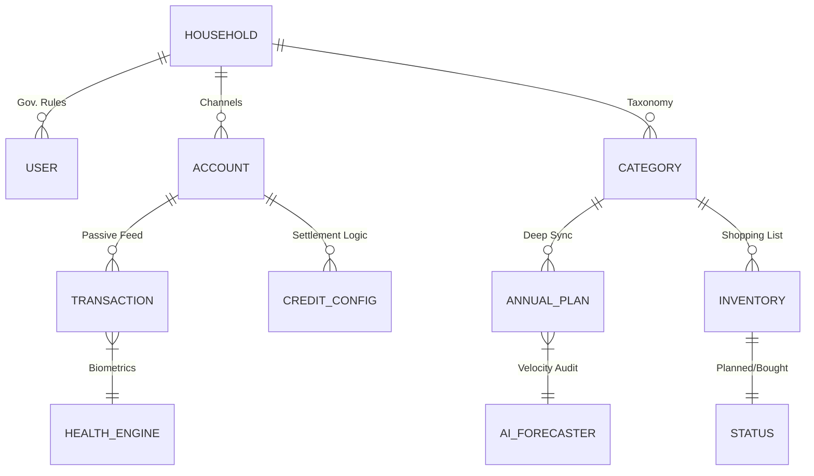

# 🛡️ FinOps v4.5: Strategic Fiscal OS
> **Proactive Intelligence & Multi-Layer Capital Resilience**

FinOps 4.5 is a professional-grade Financial Operations platform designed to transition from passive expense recording to a **proactive, state-aware management ecosystem**. It combines AI biometric diagnosis, structural liability monitoring, and multi-tenant household governance into a high-fidelity "Glassmorphism" interface.

---

## 💎 The Four Core Engines

### 1. 🧠 Intelligence & Biometrics (`ai_service`)
The system analyzes spending velocity and patterns to generate high-frequency insights:
- **Daily Run Rate (DRR)**: Velocity-based projections that calculate the end-of-month landing zone.
- **Vulnerability Metric**: Quantitative analysis of discretionary vs. essential spending ratios.
- **Anomaly Detection**: Real-time identification of transactional outliers.
- **Inflation Monitor**: Month-over-month unit price variance tracking at the line-item level.

### 2. 💳 Structural Liability Engine (`card_service`)
Advanced management of revolving credit and debt cycles:
- **Saturation Vectors**: Real-time monitoring of "Liability Usage Ratios" (Debt-to-Limit).
- **Manual Settlement Bridge**: A strategic logic layer that allows for the manual deduction of previous month CC debt from current month liquidity.
- **Cycle Orchestration**: Dynamic tracking of closing days and payment deadlines.

### 3. 👥 Multi-Household Ecosystem (`tenant_service`)
Designed for collaborative fiscal management:
- **Secret Invite Protocols**: One-time-use join codes for secure household expansion.
- **Governance Roles**: Owner/Guest permission layers with access revocation capabilities.
- **Isolated Taxonomies**: Custom domains (Sections) and classes (Categories) per household.

### 4. 📊 Deep Sync Strategic Budgeting (`expense_service`)
Integrated annual planning with dual-layered visualization:
- **The Concept Injector**: Automatic synchronization between new category creation and annual budget placeholder rows.
- **Matrix Views**: Single-toggle navigation between Current Month audit, Annual 12-month Plan, and Delta Variance comparison.
- **Net Liquidity Matrix**: Precise cash flow calculation: `Revenue - Cash Expenses - Manual CC Settlement`.

---

## 🏗️ Technical Architecture (Hexagonal)



### Stack & Infrastructure
- **Frontend**: React 18 (Vite) + Tailwind CSS v4 (Design System: Atomic Glassmorphism).
- **Backend**: FastAPI + SQLAlchemy 2.0 (PostgreSQL).
- **Intelligence**: Custom AI/Health services for 50/30/20 rule enforcement.
- **Deployment**: Worker-ready architecture (OCR, Async Tasks).

---

## 📂 Structural Mapping

```bash
├── apps/api/              # FastAPI Hexagonal Core
│   ├── application/       # Logic Layer
│   │   ├── services/      # [NEW] AI, Health, Card, Tenant, Inventory
│   ├── domain/            # Entities & Value Objects
│   └── infrastructure/    # DB Repositories & Driven adapters
├── apps/web/              # React High-Fidelity Client
│   ├── src/components/    # Atomic Design (Atoms/Molecules/Organisms)
│   ├── src/pages/         # [UPDATED] FinancialHealth, CreditCard, AnnualExpenses
│   └── src/context/       # Global State (Finance, Toast, Theme)
└── README.md              # Global Protocol
```

---

## 🚀 Vision: Proactive shopping & Fiscal Health
Version 4.5 introduces the **"Proactive Shopping List"** workflow. Inventory items are no longer just entries; they are states:
1. **Planned**: Items in the matrix with no financial impact.
2. **Bought**: Transitions to a "Locked" state, injecting the delta into the category total and updating the **Saturation Vector**.

---
**FinOps 4.5** | *Architecture by Design*
