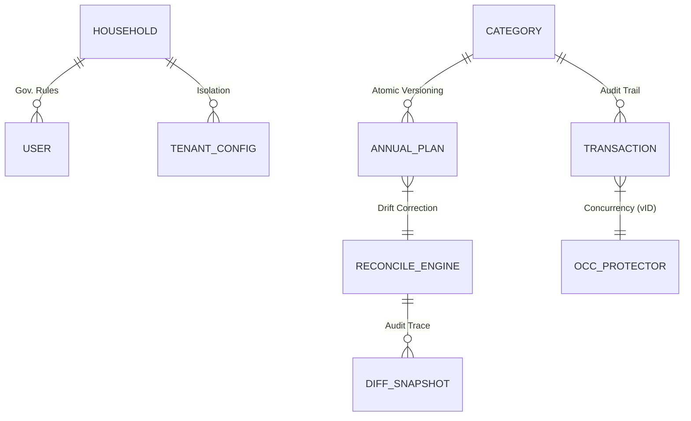

# 🛡️ FinOps v5.0: The Hardened Core
> **Enterprise-Grade Integrity, Atomic Concurrency & Structural Resilience**

FinOps 5.0 marks the transition to a **mission-critical financial ecosystem**. Beyond the glassmorphism aesthetics of v4.5, this version introduces a high-fidelity reconciliation engine, strict mathematical rigor, and optimistic concurrency controls to handle multi-user household management with zero data loss.

---

## 💎 The Five Core Engines

### 1. 🧠 Intelligence & Biometrics (`ai_service`)
High-frequency analysis of spending habits and fiscal health:
- **Daily Run Rate (DRR)**: Velocity-based landing zone projections.
- **Vulnerability Metric**: Quantitative analysis of discretionary vs. essential ratios.
- **Inflation Monitor**: Line-item tracking for unit price variance (MoM).

### 2. 💳 Structural Liability Engine (`card_service`)
Advanced management of revolving debt and liquidity cycles:
- **Manual Settlement Bridge**: Strategic logic allowing for deduction of CC debt from current month liquidity.
- **Cycle Orchestration**: Dynamic payment deadline tracking and liability usage monitoring.

### 3. 👥 Multi-Household Governance (`tenant_service`)
Enterprise-grade isolation for collaborative management:
- **Secret Invite Protocols**: Secure household expansion via one-time-use codes.
- **Governance Roles**: Granular Owner/Guest permission layers.

### 4. 🔗 Deep Sync Strategic Budgeting (`expense_service`)
Synchronization between monthly operations and annual planning:
- **The Concept Injector**: Real-time alignment between new categories and annual matrix rows.
- **Matrix Views**: Unified navigation for 12-month planning and variance auditing.

### 5. 🛠️ Reconciliation & Integrity Engine (`annual_expense_service`) [NEW - Phase 9/10]
The system's mathematical heart, ensuring structural consistency:
- **Semantic Drift Correction**: Automates the alignment between "System Totals" and "Matrix Records," ignoring technical noise (0 vs Null).
- **Dry-Run Simulations**: Risk-free auditing with visual change previews before persistence.
- **Integrity Badges**: Real-time system health monitoring (`✅ Sin drift` vs `⚠️ Inconsistencias detectadas`).

---

## 🛡️ Trust & Reliability Layers

### 🔒 Optimistic Concurrency Control (OCC)
Multi-user protection via **Version Identification**. The system prevents "Lost Updates" in high-frequency collaboration environments:
- **Conflict Interceptors**: UI-level handling of **HTTP 409 (Conflict)** errors.
- **Automated Resync**: Silent state recovery via `fetchData()` upon detection of stale data.

### 📐 Null-Safe Mathematical Architecture
Strict distinction between data states to preserve financial history:
- **null (—)**: Unknown or undefined state—prevents artificial inflation of category averages.
- **0.0 ($0)**: Explicitly validated zero value.
- **Decimal Precision**: Backend forced 2-decimal quantization for all currency-related operations.

---

## 🏗️ Technical Architecture

### Stack & Infrastructure
- **Frontend**: React 18 (Vite) + Tailwind CSS v4 (Atomic Design).
- **Backend**: FastAPI (Python 3.9+) + SQLAlchemy 2.0 (PostgreSQL).
- **Persistence**: Strict relational integrity with transactional versioning.
- **AI/OCR**: Pattern-matching engine for automated expense ingestion.

---

## 🚀 Vision: Zero-Error Financial Governance
With Phase 10, FinOps moves from a "Tracking App" to a **"Financial Operating System"**. Every transaction is audited, every structural change is simulated, and every concurrent edit is protected.

---
**FinOps 5.0** | *Precision by Architecture*
